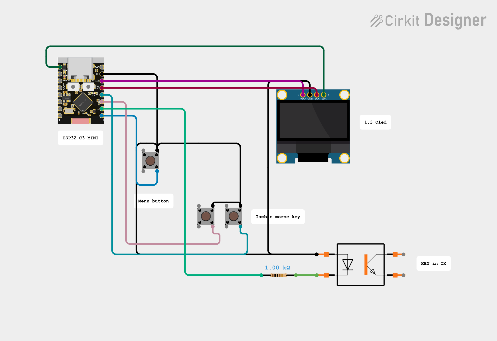

# ESP32_C3_MINI_MORSE_TRAINER
ESP32 C3 MINI MORSE TRAINER / OSCILLATOR FOR IAMBIC KEYS

Iambic Keyer + CW Decoder with ESP32-C3 Mini
 Author: LU6APR Pablo Ramos.
________________________________________
1. PROJECT DESCRIPTION
This project consists of building an electronic Iambic Keyer with an integrated Morse code decoder, based on the ESP32-C3 Super Mini microcontroller.
The device allows:
•	Transmitting Morse code using an iambic paddle (two levers: dot and dash)
•	Automatically decoding the transmitted Morse code
•	Displaying the decoded text on an OLED screen (4 lines)
•	Adjusting the transmission speed (WPM)
•	Automatic spacing after 1 second of pause
•	Automatic screen clearing when 4 lines are completed
•	Manual clearing with a short button press

Copy the code into the Arduino IDE, select the port and the ESP32 C3 mini (in my case I used the LOLIN C3 MINI), compile and upload it to the ESP32 C3 mini.

Note: the project can be assembled without the display, and it will still work as an oscillator for iambic keys...

14/8/2026

LU5DZY shared a circuit with an optocoupler to the TX, following a recommendation in a CW group of colleagues/friends.
The circuit is below. Thanks Nico!

Video: [LU5DZY_Opto.mp4](LU5DZY_Opto.mp4)
